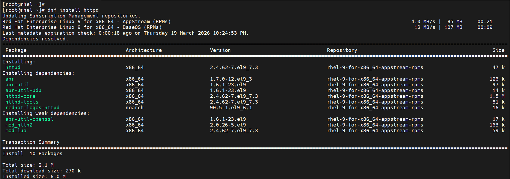
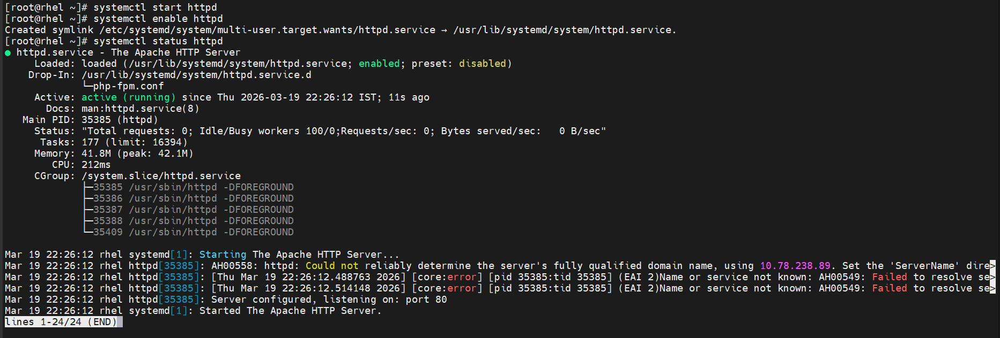
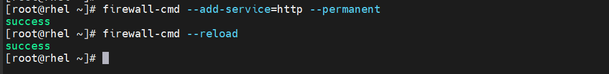
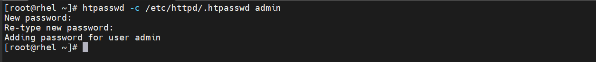
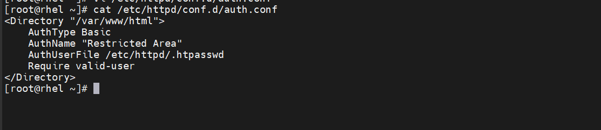
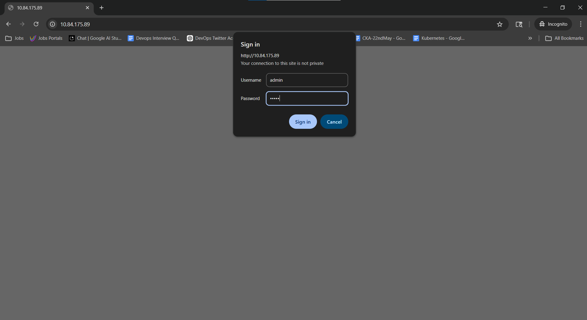
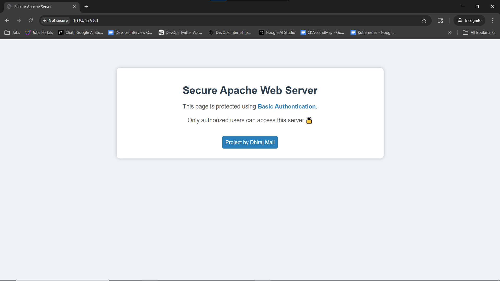

# 🔐 Secure Apache Web Server with Basic Authentication on RHEL 9

## 📌 Project Overview
This project demonstrates how to configure and secure an Apache Web Server on RHEL 9 using Basic HTTP Authentication. It ensures that only authorized users can access the hosted web content.

---

## 🚀 Key Features
✔ Apache Web Server setup on RHEL 9  
✔ Firewall configuration (port 80)  
✔ Custom web page deployment  
✔ User authentication using htpasswd  
✔ Secure access control for web content  

---

## 🛠️ Technologies Used
- RHEL 9  
- Apache (httpd)  
- firewalld  
- htpasswd utility  

---

## 📂 Project Structure
secure-apache-server-rhel9/
├── screenshots/
├── configs/
├── web-content/
├── documentation/

## ⚙️ Implementation Summary
1. Installed and configured Apache (httpd)  
2. Started and enabled Apache service  
3. Allowed HTTP traffic through firewall  
4. Created custom web page  
5. Configured Basic Authentication using htpasswd  
6. Secured Apache directory using configuration file  
7. Restarted service and tested authentication

## 📸 Screenshots

### 🔹 Apache Installation

### 🔹 Service Status

### 🔹 Firewall Configuration

### 🔹 User Authentication Setup

### 🔹 Apache Authentication Config

### 🔹 Login Prompt

### 🔹 Final Output

